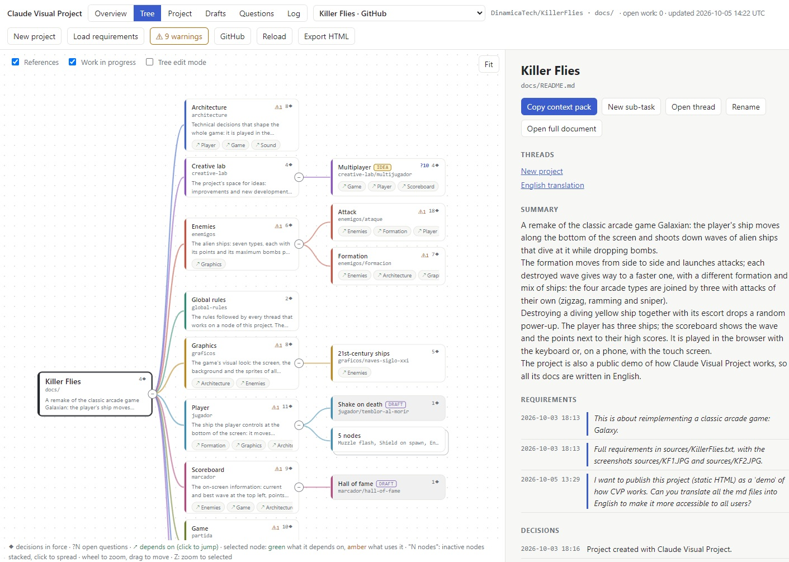

# Claude Visual Project

> Working name. The final name is still to be decided.

Visual, navigable map of AI-developed projects. Reads the Markdown docs in your repo and shows them as a tree of nodes with cross dependencies, each with its summary and design decisions. Double-click a node to get a prompt that starts a new AI thread with the right context. Works with any assistant. Single HTML file, no install.

**[Live demo](https://dinamicatech.github.io/ClaudeVisualProject/demo/)**: the map of Killer Flies, a small arcade game designed and built with this tool (a snapshot, read-only).

## What is CVP

When you build a project with AI, chats grow huge and degrade, and soon nobody knows what was decided or where. CVP starts from a simple idea: break the project down into a tree of functional areas, each with its own document, and always work on the node the task belongs to, with short threads that start with just the right context. For example, the "Data model" node is the only one that changes the database structure, and it feeds the "Updater" node, which upgrades the databases when a new version is installed.



### How it works

CVP is just a web page. It opens one or more projects, straight from their GitHub repository or from a folder on disk, and shows them as a navigable map. With a GitHub token it can also change the project (rename or move nodes…); without one it only reads it. Each node is a Markdown file with a fixed format:

- **Summary**: the functional specification of the node.
- **Requirements**: the history of everything asked of that node, in the owner's own words, with their date.
- **Decisions**: what was agreed in each piece of work, with date and time; when a decision replaces another, the old one is marked.
- **Dependencies**: the nodes it depends on (the page also shows which nodes depend on it).

A project opens on its **Overview**, a cover page with its description and screenshots, and from there you browse the map (**Tree**) or a list of rows (**Project**). Other views gather pending tasks (**Drafts**), open questions (**Questions**) and the history of decisions (**Log**).

### Working on a node

Double-click a node to copy a short prompt with its context: paste it into your assistant, add the task, and the new thread already knows what to read and which rules to follow. **New sub-task** creates a new node under it. From the node you can also open the threads that worked on it.

Before changing anything, the thread checks which node is functionally responsible for the task (if it is not the one you chose, it proposes where to take it) and shows you a breakdown: which part goes to each affected node, and even which new nodes would make sense. With your OK, it makes the whole change at once and records in each node what it now has to provide.

For a large block of requirements there is **Load requirements**: paste it (or attach the files) and the thread numbers each requirement, spreads them over the tree, proposing new nodes where needed, asks only the questions that change the tree, and leaves the rest as questions in their nodes.

### The fun part: New project

1. In one message it asks for the name, the GitHub repository, the local folder, a description and the requirement files.
2. It creates the project's skeleton (rules, ideas lab…) and asks a first round of architecture questions only.
3. With the architecture agreed, it asks the questions that can change the structure of the tree.
4. Once they are answered, it proposes the whole tree, sharing the work out among the nodes and leaving in each one its own questions. With your OK it writes it, and you watch it grow in CVP.

Every open question shows in the **Questions** view, where you can answer them all at once (the recommended option comes preselected) and copy a single prompt that records them in their nodes. On the map, each node shows **?N**, its number of open questions.

From then on, you work by starting nodes.

### Planning and ideas

- Start the prompt with **draft:** to save a future task: it becomes a child node with that single pending task, and double-clicking it brings the task already written into the prompt.
- Start it with **idea:** to put forward an idea, which lives in the **Creative lab** branch until you turn it into a draft or build it.

### Work in progress

CVP marks as **open** the nodes with unmerged work (an open branch or pull request), with the pull request number, and draws with a dashed border the new nodes that still live only in a branch. This matters: an occupied node cannot be renamed or moved, and a thread does not start a task on a node that is still running another one.

### And also

- Rename nodes, reorganize the tree by dragging nodes (**Tree edit mode**) and zoom into a node and its descendants (**Z** key).
- When a node piles up many finished children, they stack into a single card so the map stays readable.
- The working rules live in a node of the project itself: CVP's part updates itself, and you can add your own.
- The page flags badly formatted md files and broken dependencies.
- **Export HTML** builds a single file with the whole map, to share or publish.
- It works with any assistant, because it only reads and writes Markdown files.

## Usage

1. Open [`index.html`](index.html) in your browser (double-click the file). Reading a folder on disk needs Chrome or Edge.
2. Click **Open from GitHub** and write your repository (`owner/name`), or click **Open folder** and choose your repository's `docs` folder on disk. From GitHub the page is always current, with no `git pull`, and works in any modern browser: without a token it reads public repositories only and **Rename**/**Move** copy a prompt for a thread; with a fine-grained token (kept only in your browser, permission "Contents: read and write") it also reads private repositories and commits changes directly to the default branch. To keep the node index and the global rules current there, copy [`tools/project/cvp-docs.yml`](tools/project/cvp-docs.yml) to `.github/workflows/` of your repository. The page remembers every docs folder you open: the list at the top switches between projects in one click (**Open folder…** in it adds another one), each with its own view, and F5 reopens the last one.
3. A project opens on its **Overview**, a cover page with the `## Overview` section of the root node (text and screenshots kept in `docs/overview/`; the root's Summary if it has no text) and, from GitHub, the repository description. **Add image** (or Ctrl+V), **Replace** and **Delete** manage the screenshots, in a folder on disk or on GitHub with a token. Browse the project as a map of cards (**Tree**, hierarchy left to right) or as rows (**Project**). Click a node to see its summary, requirements, decisions, dependencies and warnings. Double-click it to copy a context pack: a short prompt with the files a new AI thread should read. The thread first checks which node is functionally responsible for the task and, if it is another one, asks you where the task should go: the selected node, a new node, the best existing candidate, or a draft saved for later in the node where it belongs. To leave a task for later on purpose, start your message with `draft:`. Double-clicking a draft node fills in the prompt's `Task:` with its pending task.
4. **Drafts** lists every draft node (pending tasks and work not yet validated) in a table you can sort by any column. **Log** lists every decision and requirement of the project, newest first.
5. Press F5 (or **Reload**) after the docs change.
6. To rename a node, select it and click **Rename** (or press F2). You can change its title and, optionally, its file or folder name; every `depends_on`, `replaced_by`, `[replaced by …]` marker and relative link that points to it is updated. The browser asks for permission before the page writes to your docs folder. Commit the changes in git as usual.
7. To move a node (with its descendants) to another branch, turn on **Tree edit mode** in the Tree view and drag its card onto its new parent. A dialog shows the name it will get, the inherited dependencies it can keep, and the files that move or change. If the new parent is a single file (`x.md`), it becomes a folder (`x/README.md`). After renaming or moving, the page regenerates the node index (`.index.md`) if your docs folder has one, and reloads.

### Standalone HTML

To share the map, publish it (for example on GitHub Pages) or open it in a browser that cannot read a local folder, make a snapshot: one HTML file with your docs inside. Either click **Export HTML** in the page, or run

```
node tools/build-html.mjs docs [--out file.html]
```

(copy `index.html`, `tools/build-html.mjs` and `tools/docs-folder.mjs` into your repository; Node 18 or later). The snapshot opens in any modern browser with every view and the context packs, but it does not see later changes to the docs (make it again) and cannot rename or move nodes. Anyone who can open the file can read all your docs: on GitHub, Pages sites of private repositories are public unless you are on Enterprise.

Your docs are read from disk and never copied or uploaded; the page only writes to them when you rename or move a node. The expected Markdown format is described in [`docs/format`](docs/format/README.md).

### Node index (optional)

Threads started from the copied prompts first propose which node carries out each part of the task. To find the right nodes in one read, keep a node index next to your docs: copy `index.html`, `tools/build-index.mjs`, `tools/page-model.mjs` and `tools/docs-folder.mjs` into your repository and run

```
node tools/build-index.mjs docs
```

It writes `docs/.index.md` with every node's title, dependencies, children and Summary (Node 18 or later, no packages). The prompts ask threads to run it again after changing a node; add `node tools/build-index.mjs docs --check` to your CI to catch a stale index, as [this repository does](.github/workflows/node-index.yml).

To also fail a pull request that leaves format warnings in the docs (the same warnings the page shows; dependency cycles are listed but allowed), copy `tools/check-format.mjs` too and add `node tools/check-format.mjs docs` to your CI ([example](.github/workflows/docs-format.yml)).

### Open work (optional)

To see which nodes another thread is working on, keep a list of open work next to your docs. Copy `tools/open-work.mjs` and [this workflow](.github/workflows/open-work.yml) into your repository: on every push and pull request, GitHub writes `docs/.open-work.md` on the default branch with each branch that changes md files in `docs`, its pull request, its thread link and when it started, and deletes the branch of a merged pull request. The page marks those nodes **open** in both views, lists the work in the node card, makes **Open thread** open that work's thread, and blocks renaming or moving a node while open work changes any file it would write. The list is as fresh as your last `git pull`: on Windows, double-click [`Refresh.cmd`](Refresh.cmd) and press F5.

## Status

v1. The design lives in [`docs/`](docs/README.md), written in the format the tool reads, so the project is its own first test case. Working docs are currently in Spanish.

## License

[MIT](LICENSE)
